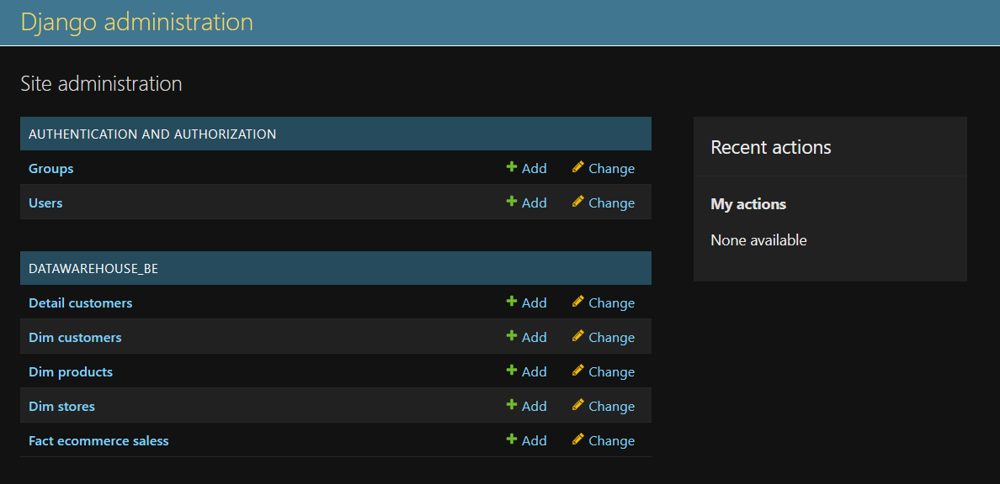

# API-Django
 
### Step 1: Activate env:
```cmd
> . ./.venv/Scripts/activate
```

### Step 2: Setup database
```
1. compose up -> docker-compose.yml 
2. vào http://localhost:80 (admin/admin)
3. vào database `dw` chọn `import`
4. gửi cái file sql lên
```
### Step 3: Run manage.py

Tạo tài khoản (admin/admin)
```cmd
> python .\manage.py createsupperuser  
```
Chạy server
```cmd
> python .\manage.py migrate
> python .\manage.py runserver
```


### Step 4: Check data:
http://127.0.0.1:8000/admin 


### Step 5: Check các API:

http://127.0.0.1:8000/detail_customer/all \
http://127.0.0.1:8000/dim_customer/all \
http://127.0.0.1:8000/dim_product/all \
http://127.0.0.1:8000/dim_store/all \
http://127.0.0.1:8000/fact_ecommerce_sales/all 