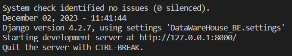

# API-Django
 
### Step 1: Activate env:
```cmd
> . ./.venv/Scripts/activate
```

### Step 2: Setup database (/DataWareHouse_BE/setting.py)
```python

# Cài theo cái Database của mọi người
DATABASES = {
    'default': {
        'ENGINE': 'django.db.backends.mysql', #giữ nguyên cái này
        'NAME': 'mysql',
        'USER': 'root',
        'HOST': 'localhost',
        'PASSWORD': 'root',
        'PORT': '3306',    
    }
}
```
### Step 3: Run manage.py

Tạo tài khoản (admin/admin)
```cmd
> python .\manage.py createsupperuser  
```
Chạy server
```cmd
> python .\manage.py migrate
> python .\manage.py runserver
```


### Step 4: Check data:
http://127.0.0.1:8000/admin 

### Step 5: Check các API:

http://127.0.0.1:8000/detail_customer/all \
http://127.0.0.1:8000/dim_customer/all \
http://127.0.0.1:8000/dim_product/all \
http://127.0.0.1:8000/dim_store/all \
http://127.0.0.1:8000/fact_ecommerce_sales/all 